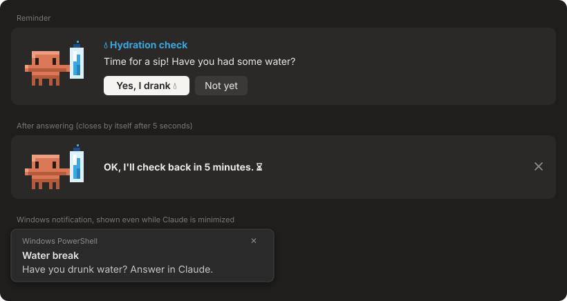
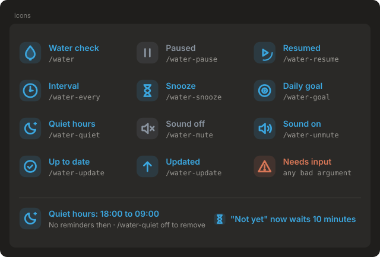

# water-reminder

A Claude Code plugin that keeps you hydrated. Every hour the Claude critter pops up above the prompt, holding a water bottle, and asks **"Have you drunk water?"**

- **Yes, I drank 💧**: the critter dances, and the next reminder comes in an hour. The glass that reaches your daily goal gets a victory jump under confetti.
- **In 5 min** / **In 10 min**: the critter lets out a sad sigh, and asks again after that long, with a slightly more worried message each time, until you say yes.

Drank without being asked? `/water-drank` logs the glass and restarts the countdown.

**Works in the Claude desktop app** (the Code tab) **and in the Claude Code terminal.** In the desktop app the critter is a pixel sprite; in the terminal it's drawn with text characters.



On **Windows**, each reminder also shows a system notification with a sound, so you see it even while Claude is minimized.

## Features

### Hydration stats

Every answer is logged, and `/water-stats` turns it into a report: the critter takes a swig while you read, glasses per day (the outline on top of a bar is the times you snoozed), what hours you drink at, and an "at a glance" panel with your peak hour, best day, streaks and trend. Your rank goes from 🌵 Cactus to 🐋 Blue Whale.



`/water-stats 30` shows the last 30 days (anything from 1 to 90). In the terminal the same report is drawn with text bars.

### Status, version and every other command

`/water-status` shows a countdown to the next water break with a progress bar. `/water-version` shows the version, who made it and a link here. The other commands answer with a short line that says what changed, and `/water-help` lists them all as buttons that put the command in the prompt box.



Replies use the plugin's own animated icon set, tinted to match the reply and as tall as it. Each icon keeps moving while it is on screen (the terminal shows emoji instead):



## Commands

| Command | What it does |
|---|---|
| `/water` | Ask the water question right now |
| `/water-status` | Show when the next reminder is due and your settings |
| `/water-stats [days]` | Chart of drinks vs. snoozes per day, your daily rhythm, streaks and a hydration rank (default 7 days) |
| `/water-pause` | Pause reminders |
| `/water-resume` | Resume reminders |
| `/water-every <minutes>` | Remind every N minutes (default 60) |
| `/water-drank` | Log a glass of water now (when you drank without a reminder) and restart the countdown |
| `/water-snooze <minutes>` | How long the first snooze button waits (default 5); the second waits twice as long |
| `/water-goal <glasses>` | Your daily goal, used by the stats, the rank and the goal celebration (default 8) |
| `/water-quiet <from>-<to>, ...` | Quiet hours with no reminders, e.g. `/water-quiet 18:00-09:00`, or several windows separated by commas, e.g. `/water-quiet 10:00-12:00, 20:00-22:00` (up to 6). A reminder that would fall inside them waits until they end. `/water-quiet off` removes them |
| `/water-mute` | Turn off the notification sound |
| `/water-unmute` | Turn the notification sound back on |
| `/water-help` | List all commands and your current settings. In the desktop app each command is a button that puts it in the prompt box, ready for Enter |
| `/water-update` | Check GitHub for a newer version and install it (then start a new session) |
| `/water-version` | Show the version, the author and a link to this repo |

Interval, snooze length, daily goal, quiet hours, pause, mute and your answer history are remembered across sessions. They are kept on your computer only, in `~/.claude/water-reminder/` (`%USERPROFILE%\.claude\water-reminder\` on Windows): `shared.json` for settings and the schedule, `log.json` for your history. Nothing is sent anywhere. Back up that folder if you want to keep your stats when moving to a new computer.

## What the plugin does on your computer

Everything water-reminder does is listed here. It never reads your conversation, makes no network requests of its own, and never sends your settings, history or anything else you wrote anywhere.

**Files it writes.** Only two, in `~/.claude/water-reminder/` (`%USERPROFILE%\.claude\water-reminder\` on Windows): `shared.json` for your settings and the schedule, which every session reads to stay in step, and `log.json` for your answer history, which `/water-stats` charts. It reads them back and touches nothing else on disk. They are the plugin's own data files, not a build, start-up, settings or instructions file: no other tool runs or obeys them, and the plugin never writes Claude Code's settings.

**Programs it starts.**
- On Windows, once per reminder: `powershell.exe -NoProfile -NonInteractive -EncodedCommand <script>`. PowerShell is the only way to show a Windows notification, so the plugin needs it. The script is written out in full in a comment above the call in `hooks/register.tsx`, and the plugin runs it in one of two fixed encodings (with and without sound). It only shows the "Water break" notification, with the system's reminder sound unless you ran `/water-mute`. It takes no input from you or the conversation.
- Only when you run `/water-update`: `claude plugin marketplace update claude-water-reminder`, then `claude plugin update water-reminder@claude-water-reminder`, Claude Code's own commands for updating a plugin. Their output says whether a newer version was installed. If `claude` can't be started directly on Windows, the same two commands run through `cmd.exe /d /c claude …`, which finds the `claude.cmd` shim of an npm install. These are the only commands it runs, each written out in full in the code.

**Network.** None of its own. `/water-update` leaves it to `claude plugin update`, which fetches the plugin from this GitHub repository the way any plugin update does.

**Hooks.**
- `session.start`: registers the `/water-*` commands and starts the reminder schedule.
- `turn.start` and `turn.complete`: redraw the reminder above the prompt so it stays on screen while Claude works. They don't read the conversation, and pass the turn on unchanged.
- `command.run`: only for the plugin's own `/water-*` commands, which it answers. It never sees or changes any other command, and makes no permission decisions.
- `ui.render`: draws the reminder card above the prompt (`AbovePrompt`) and the replies of its own commands (`CommandOutput`); every other drawing passes through unchanged.

## Requirements

- **Claude Code 2.1.286 or newer.** Earlier versions don't support plugin hook modules. Check with `claude --version`. The Claude desktop app keeps its own copy up to date.
- The system notification and sound are **Windows only** (they use PowerShell). On macOS and Linux the reminder still appears above the prompt.

## Installation

The plugin is installed once, with the `claude` command line. Both the terminal and the Claude desktop app read the same installed plugins, so one install covers both.

### 1. Open a terminal

- **Windows:** PowerShell or Windows Terminal.
- **macOS / Linux:** any terminal.

Check that Claude Code is installed and new enough (2.1.286 or newer):

```bash
claude --version
```

If `claude` is not found, install Claude Code first: <https://docs.claude.com/en/docs/claude-code/setup>.

### 2. Add the marketplace

This tells Claude Code where to find the plugin (this GitHub repo):

```bash
claude plugin marketplace add YossiAbutbul/claude-water-reminder
```

### 3. Install the plugin

```bash
claude plugin install water-reminder@claude-water-reminder
```

Installing also enables it. There is nothing else to switch on.

### 4. Start a new session

Plugins load when a session starts, so sessions that were already open won't have it.

- **Terminal:** run `claude`.
- **Desktop app:** start a new session in the Code tab.

### 5. Check that it works

Type:

```
/water-status
```

You should see when the next reminder is due. Then run `/water` to see the critter and the question right away. On Windows a system notification with a sound appears too.

## Updating

From version 0.3.0 on, type `/water-update` in any session: it checks this repo for a newer version, installs it, and tells you to start a new session.

You can also update from a terminal:

```bash
claude plugin marketplace update claude-water-reminder
claude plugin update water-reminder@claude-water-reminder
```

Then start a new session.

## Uninstalling

```bash
claude plugin uninstall water-reminder@claude-water-reminder
claude plugin marketplace remove claude-water-reminder
```

Your settings and drinking history stay in `~/.claude/water-reminder/`. Delete that folder to remove them too.

## Troubleshooting

| Problem | Fix |
|---|---|
| `/water` is not in the command list | Start a **new** session after installing. Check `claude --version` is 2.1.286 or newer. |
| Reminders appear twice | The plugin is loaded twice, for example installed **and** also listed in `CLAUDE_CODE_PLUGIN_DIRS` in `~/.claude/settings.json`. Keep only one. |
| No Windows notification or sound | Run `/water-unmute`. Check that notifications are allowed for **Windows PowerShell** in *Settings → System → Notifications*, and that Focus / Do not disturb is off. |
| No sound on macOS / Linux | Expected: the system notification is Windows only. The reminder still appears above the prompt. |

### Try it once without installing

To load it for a single terminal session only:

```bash
git clone https://github.com/YossiAbutbul/claude-water-reminder.git
claude --plugin-dir ./claude-water-reminder
```

## Notes

- Reminders run only while a Claude Code session is open.
- Open sessions share one schedule: a reminder pops up in all of them at the same time, only one sends the Windows notification, and answering in any session clears the others within a few seconds (and is never counted twice). Settings changed in one session (`/water-every`, `/water-pause`, `/water-mute`…) reach the others the same way.

## Development

The tests load the real plugin against an in-memory folder and a fake clock, so they never touch your settings, send notifications or call GitHub. Run them with Claude Code 2.1.286 or newer:

```bash
claude plugin test .
```

## Versions

See [CHANGELOG.md](CHANGELOG.md) for what changed in each version, and the [tags](https://github.com/YossiAbutbul/claude-water-reminder/tags) for every released version. `/water-version` shows the one you have.

## License

MIT © 2026 Yossi Abutbul. See [LICENSE](LICENSE).
